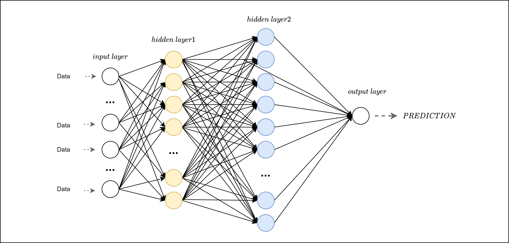

# Workshop-Water-demand-forecasting-in-Python
Improve the sustainable management of water networks: develop a water demand forecasting algorithm with neural networks in Python

What could we do with the knowledge of our water network future consumption? Surely, we can consistently improve and optimize the way we use water. For instance, knowing the consumption of the following day would permit an optimal selection of the pump operation, with consequent important savings in terms of energy and money. This is one of the reasons why the development of reliable water demand forecasting algorithms is a really hot topic in the scientific community. Clearly, water demand forecasting is not an easy task due the strong stochastic behavior of our consumption, which depend mainly by our habits. However, in the latest decades, we have a new ally for the development of such algorithm: the increase of data availability. Therefore, during this workshop we will see how we can develop a powerful algorithm for predicting the future water demand of a water network, based on the data-driven idea that is at the basis of the machine and deep learning philosophy. Therefore, we will take some data and create and ANN algorithm step-by-step using Python, analyzing the results and the methodology. Hence the workshop will be developed as follows:
- Introduction to the importance of sustainability of water networks, and on the new challenge of today.
- Discuss the idea of water demand forecasting and give a closer look to the data-driven idea behind machine learning algorithms.
- Develop a step-by-step code that, starting form some data analysis, will arrive at the development of a neural network model for predicting water demand time series.
- Analyze the output, and discuss the potential of such approach.
